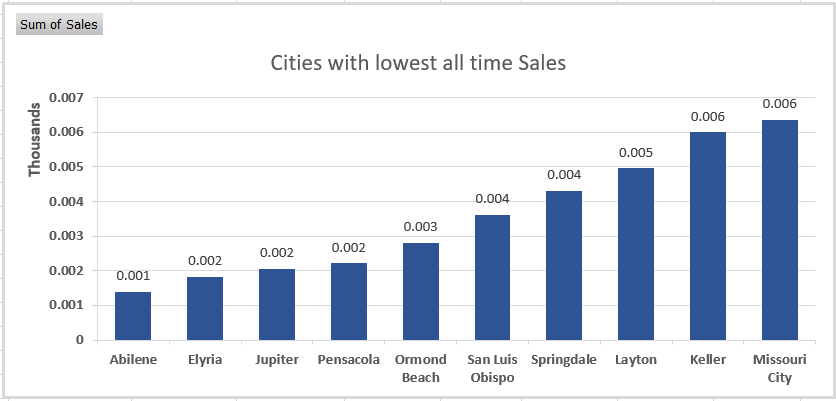

# FurniTech Solutions Sales Data Analysis

---

## Table of Contents
* [Introduction](#introduction)
    * [Company background](#company-background)
    * [Current position](#current-position)
    * [Company objectives](#company-objectives)
* [Executive summary](#executive-summary)
    * [The problem](#the-problem)
    * [The analysis's goal](#the-analysiss-goal)
    * [The data and techniques employed](#the-data-and-techniques-employed)
    * [Brief interpretation of results](#brief-interpretation-of-results)
* [Main body](#main-body)
    * [Summary of errors in data](#summary-of-errors-in-data)
    * [Additional calculations and columns](#additional-calculations-and-columns)
    * [Hypothesis](#hypothesis)
* [Analysis](#analysis)
    * [Written insights](#written-insights-explaining-the-outcomeresults-of-each-analysis-and-response-to-hypothesis)
* [Conclusion](#conclusion)
* [Recommendations for action](#recommendations-for-action)
* [Dashboard](#dashboard)

## Introduction
This is an Excel project of an **imaginary store** called **FurniTech Solutions**. Data set was provided on Youtube video description (name of the channel: Skillnator, name of the video: "Create interactive excel dashboard in 5 simple steps". The project aims to provide insights into the sales performance of the company. By analysing data we seek to identify trends and gain a deeper understanding of the company's performance.

### Company background
FurniTech Solutions operates in the retail industry, specialising in online sales of furniture, office supplies and technology.

### Current position
Despite strong sales performance, FurniTech Solutions faces challenges in analysing sales data efficiently and deriving actionable insights.

### Company objectives
The primary objectives include optimising inventory management, identifying top-performing products, and enhancing overall sales performance.

## Executive summary

### The problem
FurniTech Solutions struggles to effectively track sales trends, monitor inventory levels, and identify areas for improvement due to the complexity and volume of sales data. 

### The analysis's goal
The goal of this analysis is to analyse historical data to identify trends and petterns and to develop an interactive Excel dashboard that enables FurniTech Solutions to visualize sales data dynamically and derive actionable insights.

### The data and techniques employed
Sales data from FurniTech Solutions were collected and analysed using Excel. Techniques such as pivot tables, charts, slicers and conditional formatting were employed to create interactive visualisations.

### Brief interpretation of results
The interactive dashboard enables FurniTech Solutions to monitor sales trends and identify opportunities for growth and optimisation.

## Main body

### Summary of errors in data
The dataset was carefully reviewed for errors but no duplicate values, data inconsistencies or missing values were found.

### Additional calculations and columns
Additional calculated column was made:
- Price (Sales/Quantity).

### Hypothesis
- **Which customer segment is the best-selling and most profitable** (Understanding which customer segment contributes the most to sales and profits allows for targeted marketing efforts and tailored customer experiences. It helps in allocating resources effectively towards segments that offer the highest return on investment);
- **Which product category has the highest sales and profit** (Identifying the top-performing product categories informs inventory management, pricing strategies, and product development efforts. It guides decision-making on resource allocation and expansion opportunities in high-demand product categories);
- **Correlation between quantity sold and profit** (Analyzing the relationship between quantity sold and profit provides insights into pricing strategies, production costs, and overall profitability);
- **How discount impact sales** (Understanding the impact of discounts on sales revenue helps in designing effective promotional campaigns and pricing strategies. It informs decisions on discounting levels, timing, and target segments to achieve desired sales outcomes while maintaining profitability);
- **Which regions have the highest and lowest sales and profits** (Identifying regional sales and profit performance highlights geographic market opportunities and challenges. It guides resource allocation, market expansion strategies, and localized marketing efforts to capitalize on high-performing regions and address underperforming ones);
- **Which states and cities have the highest and lowest sales and profits** (This analysis will provide insights into the regional performance of the business and help identify areas of strength and opportunities for improvement);
- **Trends in sales and profit over time** (Monitoring sales and profit trends over time provides insights into business performance, market dynamics, and seasonality effects. It helps in forecasting future sales, identifying growth opportunities, and adjusting strategies to align with changing market conditions).

## Analysis

    
    

Based on the charts, it is evident that the Consumer segment generates the highest sales and profit, while the Home Office segment demonstrates lower performance.

    
    

We can see from the charts that the product category with the highest sales and profit is Technology. There is a significant disparity in profit between the Furniture product category and Office Supplies and Technology, with Office Supplies and Technology generating at least six times more profit than Furniture. Interestingly, despite this difference in profit, the sales charts indicate that Furniture actually has higher sales than Office Supplies.

    

To understand the correlation between quantity sold and profit, I conducted a correlation analysis. The results of this analysis reveal that there is no correlation between the quantity sold and profit.

    

    

To understand how discounts impact sales, I created a pivot table with pivot chart and conducted a correlation analysis. As shown in the chart, there is no correlation between discount and sales. Interestingly, the highest sales were recorded with a discount of 20%. Furthermore, the correlation analysis confirms the absence of any correlation between discounts and sales. Overall, the purpose of this analysis was to investigate whether higher discounts influence sales. However, the findings suggest that discount percentage alone may not be a significant driver of sales

    
    

As observed from the charts, the West and East regions exhibit the highest sales and profits. Interestingly, although the Central region demonstrates higher sales than the South, it actually has lower profits compared to the South region.

    
    

As evident from the charts, California and New York demonstrate the highest all time sales and profits, surpassing other states by at least two times.

    
    

But if we look at the states with lowest all time sales and profit, we can notice, that despite Texas, Pennsylvania, Illinois, and Florida ranking in the top 10 states with the highest all-time sales, they actually have some of the smallest all-time profits. This suggests a notable disparity between sales revenue and profitability in these states.

    
    

As evident from the charts, New York City, Los Angeles, and Seattle emerge as the cities with the highest all-time sales and profits. Remarkably, New York City stands out with profits exceeding those of other cities by at least two times.

    
    

A similar trend is evident when examining cities, where Philadelphia, Houston, Chicago, and Jacksonville rank among the top 10 cities with the highest all-time sales. However, despite their strong sales performance, these cities exhibit some of the smallest all-time profits.

    
    

The charts illustrate change in sales, price, and profit over a four-year period. A clear seasonal pattern is evident, with consistent growth in sales and profit during the fourth quarter of each year. Additionally, the fourth quarter of 2016 stands out as the top-performing period, characterized by both high sales volume and prices.

### Written insights explaining the outcome/results of each analysis and response to hypothesis
- **Which customer segment is the best-selling and most profitable**: Consumer segment has the highest sales and profit, while the Home Office segment underperforms.
- **Which product category has the highest sales and profit**: Technology product category has the highest sales and profit. While Office Supplies has the lowest sale, it actually has the big profit.
- **Correlation between quantity sold and profit**: There is no correlation between quantity sold and profit.
- **How discount impact sales**: Discount does not have a significant influence on sales.
- **Which regions have the highest and lowest sales and profits**: East and West regions have the highest sales and profit. While the Central region has higher sales than the South, it actually has lower profits.
- **Which states and cities have the highest and lowest sales and profits**: California and New York have the highest sales and profit. While Texas ranks third in all-time sales, it actually has the lowest all-time profit. New York City and Los Angeles have the highest all time sales and profit. New York City stands out with profits exceeding those of other cities by at least two times.
- **Trends in sales and profit over time**: There is a seasonal pattern, with the highest sales and profit occurring in the fourth quarter of each year.

## Conclusion
The analysis of sales data has revealed important trends and patterns, providing valuable insights into the performance of different segments, categories, regions, and time periods. These insights enable informed decision-making and strategic planning to drive business growth and profitability.

## Recommendations for action
Based on the identified trends and opportunities, the following recommendations are suggested to optimize sales strategies and enhance profitability:
- Implement targeted marketing campaigns: Utilize the insights gained from the analysis to tailor marketing efforts towards high-performing segments, products, and regions;
- Enhance customer engagement: Leverage personalized promotions, discounts, and customer-centric initiatives to foster loyalty and drive repeat purchases;
- Monitor seasonal trends: Continuously monitor sales and profit trends over time, particularly during peak seasons, to capitalise on opportunities and mitigate risks;
- Invest in data-driven decision-making: Further develop and utilise interactive dashboards and analytical tools to track performance metrics, identify emerging trends, and make informed decisions in real-time.

## Resources
https://www.youtube.com/watch?v=eaSg0mu6nLM&ab_channel=Skillnator

## Dashboard

---
